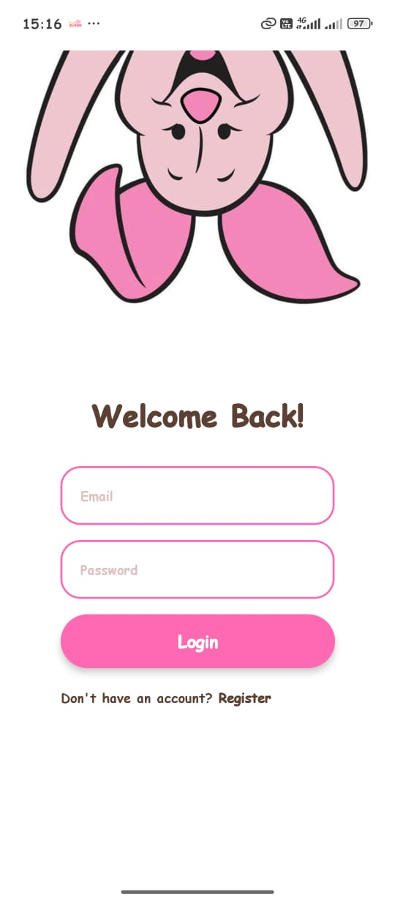
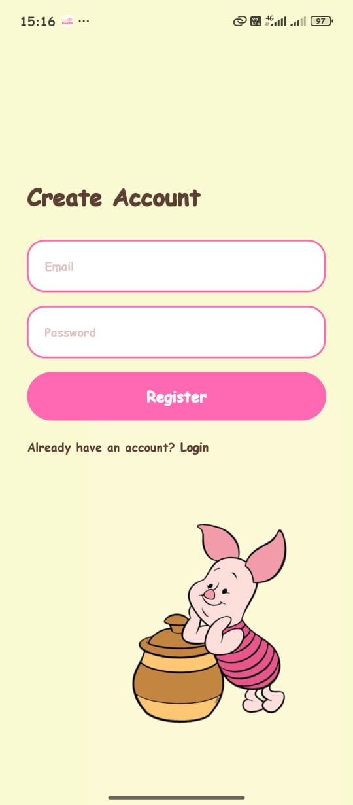
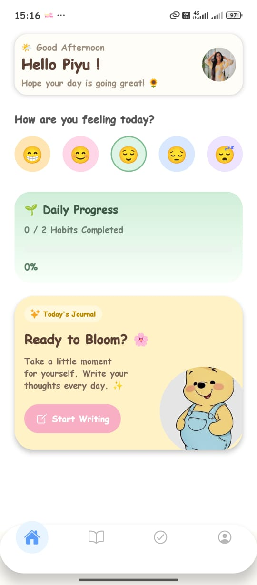
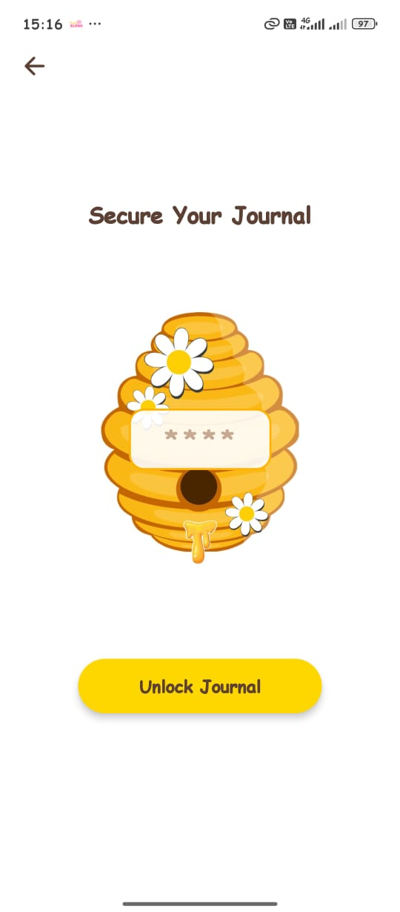
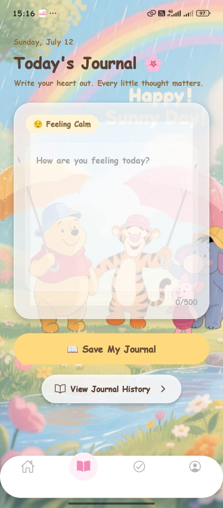
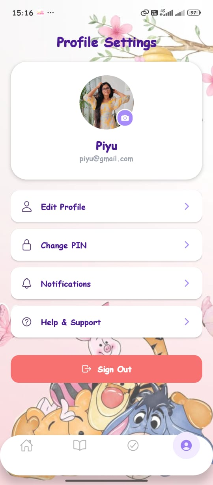
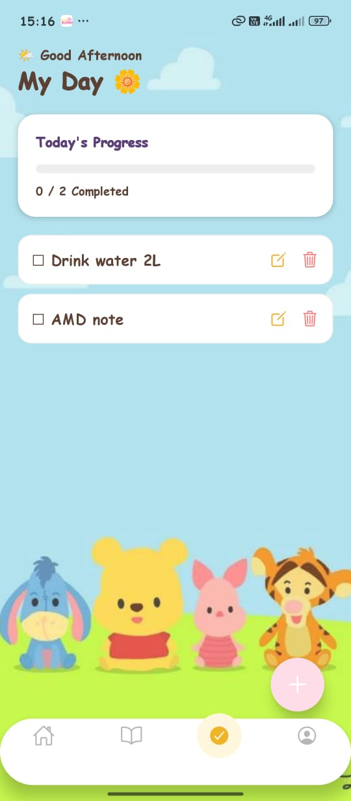
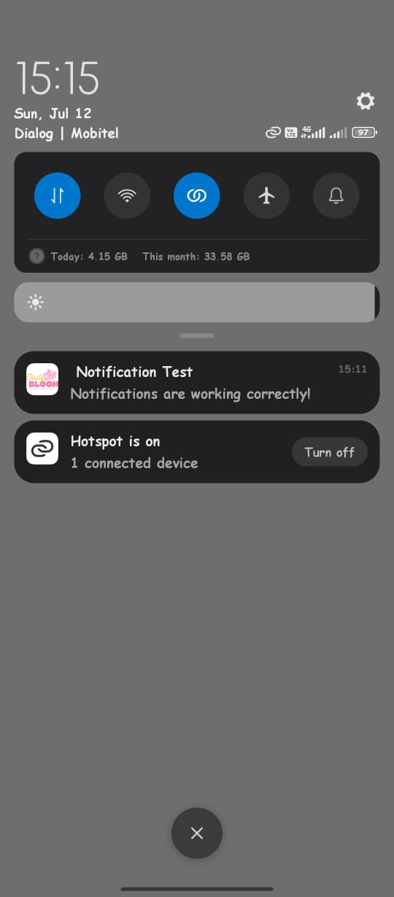

# DailyBloom - Journal & Habbit Tracker 🌸

## Project Overview
DailyBloom is a cross-platform mobile application developed for the Advanced API Development (AAD) module. It helps users track daily habits, manage tasks, and maintain a personal journal in a minimalist, user-friendly environment.

## Features
* **User Authentication:** Secure login and sign-up powered by Firebase.
* **Habit & Task Management:** Create, Read, Update, and Delete daily activities.
* **Smart Notifications:** Local notifications with user-controlled settings.
* **Profile Management:** Personalize your profile with custom images.
* **Journaling:** A dedicated space to reflect on daily progress.

## Technologies Used
* **Frontend:** React Native (Expo)
* **Backend:** Firebase Firestore & Firebase Auth
* **Navigation:** Expo Router
* **Storage:** AsyncStorage
* **Icons:** @expo/vector-icons

## 📱 Download App
[**Click here to download the DailyBloom APK**](https://expo.dev/accounts/piyumalsha/projects/dailybloom/builds/21ce2e89-9c50-4235-941b-cb5417964432](https://expo.dev/artifacts/eas/XqxmMGNBUKBJimAZdkErBGnYAlmVoYhUXiSbGzkP4BY.apk)

## Screenshots

| Login | Register | Home | Pin Setup |
| :---: | :---: | :---: | :---: |
|  |  |  |  |

| Journal | Profile | Habits | Notifications |
| :---: | :---: | :---: | :---: |
|  |  |  |  |
